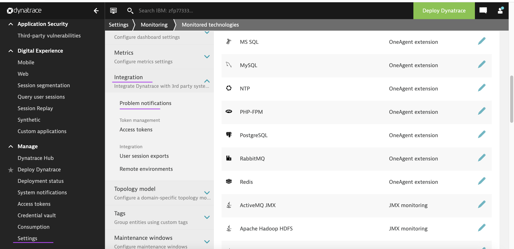
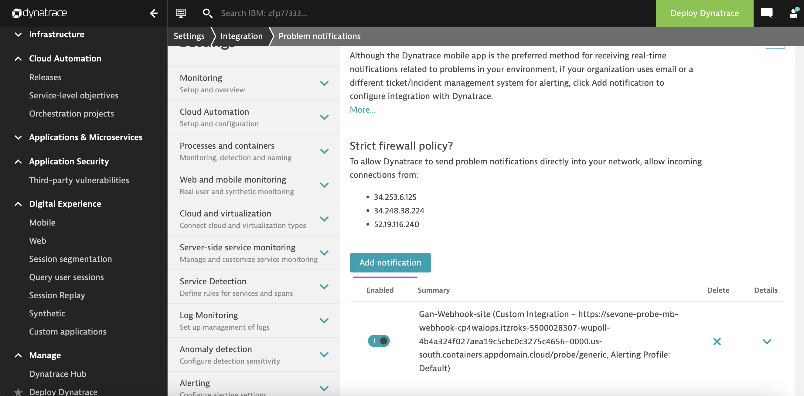
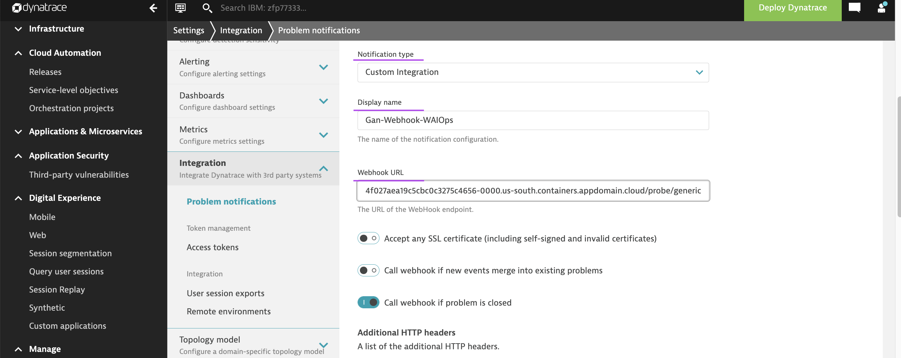
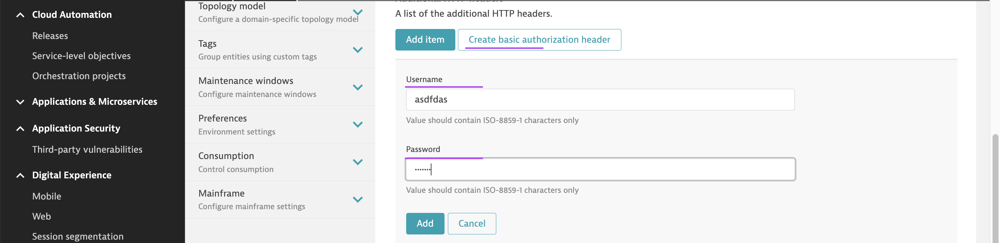
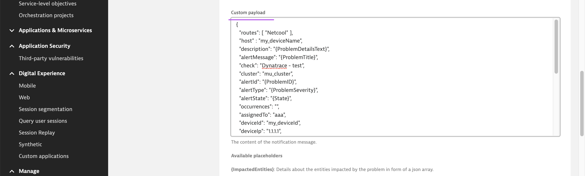
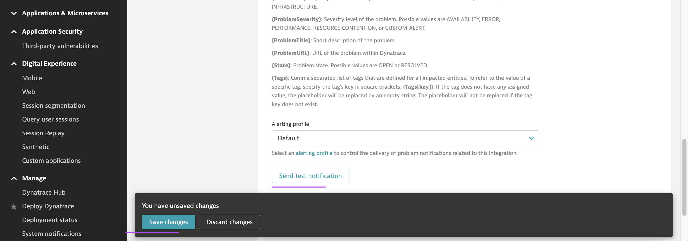
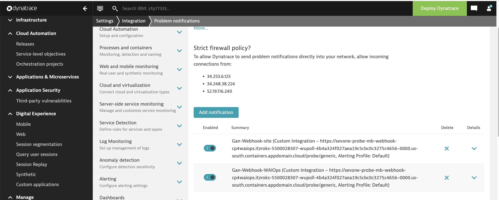
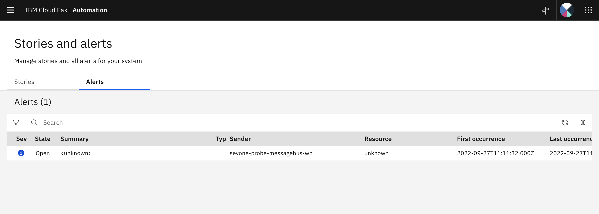

# Dyantrace to WAIOps Alert Configuration

This document explains how to create alert notification in Dyantrace to push the alerts to WAIOps webhook.

## Create Notification entry in Dynatrace

1. Click on `Settings > Integration > Probelm Notifications`

2. Click on `Add Notification`

3. Enter the following.

- Display Name : Any text
- Webhook URL : WAIOPs Webhook URL Created .

3. Click on the `Create basic authentication header` button.

4. Enter the following.

- UserName : WAIOPs Webhook URL user.
- Password : WAIOPs Webhook URL password.

5. Copy and paste the custom payload from the file [files/dyna-mapping.json](./files/dyna-mapping.json).

This file needs to be updated with right mappings in future.

6. Try sending test notification to WAIOps using the `send test notification` button.

7. Click on `Save Changes` to save the entry.

8. See the noticiation entry created.

## View Alert in WAIOps

View the alert created for the test notification in WAIOps.

Note: This payload to be improved to have all the columns populated in the Alert.